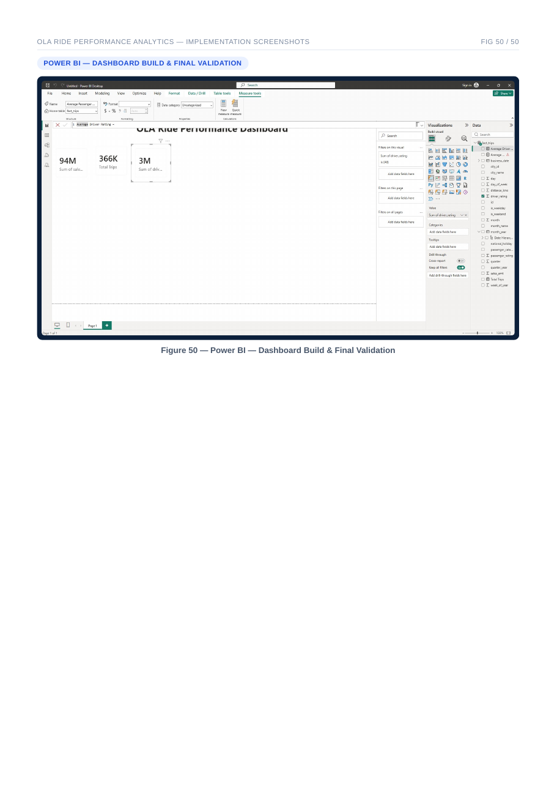

# OLA Ride Performance Analytics Pipeline

Portfolio implementation of a Databricks/PySpark lakehouse pipeline for ride-level analytics. It cleans trip and city data, builds a calendar dimension, publishes a Delta fact table, and defines the Power BI measures used for performance reporting.



## What is implemented

- Bronze ingestion with source-file and ingestion timestamps
- Silver cleaning, type casting, rating validation, and trip-level deduplication
- Calendar attributes for month, quarter, week, weekday/weekend, and Indian national holidays
- Gold fact table joined to city and calendar dimensions
- Delta Lake full refresh and incremental `MERGE` paths
- Power BI measures for trips, sales, distance, and average ratings


## Repository structure

```text
├── src/ola_pipeline.py          # full and incremental PySpark pipeline
├── sql/dashboard_dataset.sql    # analytics view
├── powerbi/measures.dax         # dashboard measures
├── sample_data/                 # small synthetic input for schema review
├── scripts/validate_project.py  # credential-free checks
└── docs/powerbi-implementation.png
```

## Input schemas

`trips.csv`

```text
trip_id,date,city_id,passenger_type,distance_travelled_km,
fare_amount,passenger_rating,driver_rating
```

`cities.csv`

```text
city_id,city_name
```

The original training dataset used during the local build is not redistributed because its license was not supplied. The tracked files under `sample_data/` are synthetic and exist only to document the expected schema.

## Run in Databricks

1. Upload trip and city CSV files to storage accessible by Databricks.
2. Install `delta-spark` if it is not provided by the runtime.
3. Run a full load:

```bash
spark-submit src/ola_pipeline.py \
  --trips-path /path/to/trips \
  --cities-path /path/to/cities.csv \
  --catalog transportation \
  --mode full
```

4. For later trip files, point `--trips-path` at the incremental folder and use `--mode incremental`.
5. Run `sql/dashboard_dataset.sql`, then connect Power BI to the resulting Databricks SQL view.

## Validation rules

- Trip IDs, dates, and city IDs must be present.
- Driver and passenger ratings must be between 1 and 10.
- Negative distance and fare values are removed.
- Duplicate trip IDs are resolved using the latest ingestion timestamp.
- Incremental loads upsert by `trip_id`.

## Local checks

```bash
python -m py_compile src/ola_pipeline.py
python scripts/validate_project.py
```

The checked-in screenshot demonstrates the Power BI build. A live Databricks workspace, cloud storage, and Power BI refresh credentials are required to run the full integration.

