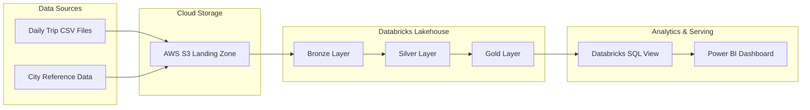
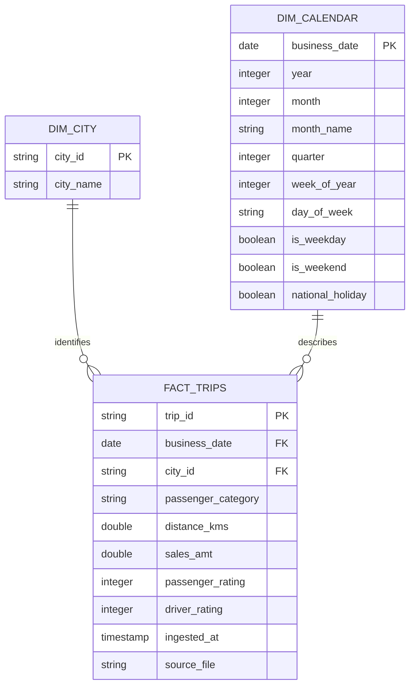

# OLA Ride Performance Analytics Pipeline


An end-to-end ride analytics project built with **Databricks, PySpark, Delta Lake, SQL, AWS S3, and Power BI**.

The pipeline ingests ride-level data, validates and standardizes records, enriches trips with city and calendar dimensions, and publishes an analytics-ready Gold table. It supports both full refreshes and incremental Delta Lake upserts.

The final Power BI dashboard analyzes approximately **366K trips**, **₹94M in sales**, **3M kilometres travelled**, ratings, passenger behavior, city performance, and time-based trends.

---

## Final Power BI Dashboard


### Dashboard KPIs

| KPI | Dashboard Result |
|---|---:|
| Total sales | Approximately ₹94M |
| Total trips | Approximately 366K |
| Total distance | Approximately 3M KM |
| Average driver rating | 7.85 |
| Average passenger rating | 7.92 |
| Cities analyzed | 10 |
| Analysis period | August–December 2025 |

The dashboard includes interactive filters for:

- Business date
- City
- Passenger category
- Weekend or weekday

---

## Business Questions

The analytical model and dashboard answer the following questions:

- Which cities generate the highest sales?
- How does monthly sales performance change over time?
- Which cities have the highest driver ratings?
- How do passenger ratings vary by city?
- What percentage of trips comes from new and repeated passengers?
- How does demand differ between weekdays and weekends?
- Which days generate the highest trip volumes?
- How much total distance is covered in each city?
- Are passenger and driver ratings aligned across markets?

---

## Project Architecture



### End-to-end flow

```text
Trip and City CSV Files
          │
          ▼
AWS S3 Landing Zone
          │
          ▼
Bronze Delta Data
Raw records + source metadata
          │
          ▼
Silver Trip Data
Cleaning + validation + deduplication
          │
          ▼
Gold fact_trips
City + calendar enrichment
          │
          ▼
Databricks SQL View
          │
          ▼
Power BI Dashboard
```

---

## Technology Stack

| Layer | Technology | Responsibility |
|---|---|---|
| Cloud storage | AWS S3 | Stores source and incremental files |
| Lakehouse platform | Databricks | Executes the data pipeline |
| Processing engine | Apache Spark | Distributed data transformations |
| Programming | PySpark | Cleans, validates and enriches data |
| Table format | Delta Lake | Full loads and incremental upserts |
| Governance | Unity Catalog | Organizes catalog, schema and table access |
| Analytics | Databricks SQL | Exposes the reporting dataset |
| Visualization | Power BI | Presents business KPIs and trends |
| Data modeling | SQL and DAX | Defines the reporting view and dashboard measures |
| Validation | Python | Performs credential-free repository checks |

---

## Lakehouse Layers

### Bronze layer

The Bronze layer ingests ride data with an explicit schema and operational metadata.

```python
def read_bronze_trips(spark: SparkSession, path: str) -> DataFrame:
    return (
        spark.read
        .option("header", True)
        .schema(TRIP_SCHEMA)
        .csv(path)
        .withColumn("source_file", F.input_file_name())
        .withColumn("ingested_at", F.current_timestamp())
    )
```

Bronze responsibilities:

- Read trip CSV files
- Apply a defined schema
- Preserve source records
- Record the input filename
- Add the ingestion timestamp
- Provide traceability for downstream processing

---

### Silver layer

The Silver layer applies data-quality rules and standardizes the ride records.

Implemented transformations include:

- Renaming business columns
- Standardizing passenger categories
- Casting dates and numeric values
- Rejecting missing trip IDs
- Rejecting missing business dates
- Rejecting missing city IDs
- Rejecting negative fare values
- Rejecting negative distances
- Validating ratings between 1 and 10
- Removing duplicate trip IDs
- Keeping the most recently ingested record

```python
valid = (
    bronze
    .withColumn(
        "passenger_category",
        F.lower(F.trim("passenger_type"))
    )
    .withColumnRenamed("date", "business_date")
    .withColumnRenamed(
        "distance_travelled_km",
        "distance_kms"
    )
    .withColumnRenamed("fare_amount", "sales_amt")
    .filter(F.col("trip_id").isNotNull())
    .filter(F.col("business_date").isNotNull())
    .filter(F.col("city_id").isNotNull())
    .filter(F.col("distance_kms") >= 0)
    .filter(F.col("sales_amt") >= 0)
    .filter(F.col("passenger_rating").between(1, 10))
    .filter(F.col("driver_rating").between(1, 10))
)
```

### Deduplication strategy

Duplicate trip IDs are resolved using an ingestion-time window:

```python
newest_record = (
    Window
    .partitionBy("trip_id")
    .orderBy(F.col("ingested_at").desc())
)

silver = (
    valid
    .withColumn(
        "row_number",
        F.row_number().over(newest_record)
    )
    .filter("row_number = 1")
    .drop("row_number")
)
```

This makes the latest ingested version of a trip the trusted Silver record.

---

### Gold layer

The Gold layer combines:

- Validated trip records
- City reference data
- Calendar attributes

```python
gold = (
    trips
    .join(F.broadcast(cities), "city_id", "inner")
    .join(calendar, "business_date", "inner")
    .select(
        "trip_id",
        "business_date",
        "city_id",
        "city_name",
        "passenger_category",
        "distance_kms",
        "sales_amt",
        "passenger_rating",
        "driver_rating",
        "year",
        "month",
        "month_name",
        "quarter",
        "week_of_year",
        "day_of_week",
        "is_weekday",
        "is_weekend",
        "national_holiday",
        "ingested_at",
        "source_file",
    )
)
```

The output is published as:

```text
transportation.gold.fact_trips
```

---

## Incremental Processing

The pipeline supports two execution modes.

### Full load

A full load overwrites the target Delta table and partitions it by year and month:

```python
gold.write \
    .format("delta") \
    .mode("overwrite") \
    .partitionBy("year", "month") \
    .saveAsTable(table_name)
```

### Incremental load

Incremental records are upserted through Delta Lake `MERGE` using `trip_id` as the business key:

```python
target.alias("target") \
    .merge(
        gold.alias("source"),
        "target.trip_id = source.trip_id"
    ) \
    .whenMatchedUpdateAll() \
    .whenNotMatchedInsertAll() \
    .execute()
```

This design provides:

- Repeatable incremental ingestion
- Updates for previously received trips
- Inserts for new trips
- Protection against duplicate business keys
- A single current version of each trip

---

## Calendar Dimension

The pipeline generates calendar attributes for the available trip-date range.

Generated attributes include:

| Attribute | Purpose |
|---|---|
| `year` | Annual analysis |
| `month` | Numerical month sorting |
| `month_name` | Dashboard display |
| `quarter` | Quarterly reporting |
| `week_of_year` | Weekly analysis |
| `day_of_week` | Day-level demand analysis |
| `is_weekday` | Weekday segmentation |
| `is_weekend` | Weekend segmentation |
| `national_holiday` | Holiday performance analysis |

The implementation marks these Indian national holidays:

- Republic Day
- Independence Day
- Gandhi Jayanti

---

## Analytical Data Model



---

## Reporting View

The Gold Delta table is exposed through a dedicated analytics view:

```sql
CREATE OR REPLACE VIEW
    transportation.gold.vw_ride_performance
AS
SELECT
    business_date,
    city_id,
    city_name,
    passenger_category,
    distance_kms,
    sales_amt,
    passenger_rating,
    driver_rating,
    year,
    month,
    month_name,
    quarter,
    week_of_year,
    day_of_week,
    is_weekday,
    is_weekend,
    national_holiday
FROM transportation.gold.fact_trips;
```

Source: [`sql/dashboard_dataset.sql`](sql/dashboard_dataset.sql)

This provides Power BI with a stable reporting interface instead of connecting directly to intermediate pipeline data.

---

## Power BI Measures

The dashboard uses the following DAX measures:

```DAX
Total Sales =
SUM(fact_trips[sales_amt])

Total Trips =
COUNTROWS(fact_trips)

Total Distance =
SUM(fact_trips[distance_kms])

Average Driver Rating =
AVERAGE(fact_trips[driver_rating])

Average Passenger Rating =
AVERAGE(fact_trips[passenger_rating])
```

Source: [`powerbi/measures.dax`](powerbi/measures.dax)

---

## Dashboard Components

### KPI cards

- Total sales
- Total trips
- Total distance
- Average driver rating
- Average passenger rating

### Analytical visuals

- Sales by city
- Monthly sales trend
- Driver rating by city
- Passenger rating by city
- Trips by passenger category
- Weekend versus weekday trips
- Trips by day
- City performance matrix

### Filters

- Business date
- City
- Passenger category
- Weekday or weekend

---

## Dashboard Analysis

### City performance

The dashboard shows Jaipur as the leading city by sales, followed by Lucknow and Hyderabad.

City-level comparisons combine:

- Total sales
- Trip volume
- Distance travelled
- Driver rating
- Passenger rating

### Monthly trend

Sales rise across the August–December analysis period, with December showing the strongest monthly performance.

### Passenger composition

The dashboard separates:

- New passengers
- Repeated passengers

This supports retention and repeat-usage analysis.

### Weekly behavior

The weekday/weekend split and trips-by-day chart reveal how ride demand changes throughout the week.

### Service quality

Driver and passenger ratings are compared across cities to identify markets with strong revenue but weaker experience scores.

---

## Browser Dashboard Preview

A browser-based dashboard was also created to reproduce the analytical layout outside Power BI.


The browser version is a presentation prototype built from the dashboard metrics. The Power BI screenshot above is the implementation evidence.

---

## Repository Structure

```text
ola-ride-performance-analytics/
│
├── src/
│   └── ola_pipeline.py
│
├── sql/
│   └── dashboard_dataset.sql
│
├── powerbi/
│   └── measures.dax
│
├── sample_data/
│   ├── trips.csv
│   └── cities.csv
│
├── scripts/
│   └── validate_project.py
│
├── docs/
│   ├── ola-power-bi-dashboard.png
│   └── dashboard-browser-preview.png
│
├── requirements.txt
├── .gitignore
└── README.md
```

---

## Input Schemas

### Trip data

```text
trip_id
date
city_id
passenger_type
distance_travelled_km
fare_amount
passenger_rating
driver_rating
```

Example:

```csv
trip_id,date,city_id,passenger_type,distance_travelled_km,fare_amount,passenger_rating,driver_rating
TRIP001,2026-01-01,RJ01,new,12,180,8,9
TRIP002,2026-01-01,UP01,repeated,7,105,9,8
TRIP003,2026-01-02,GJ01,new,18,270,7,9
```

### City data

```text
city_id
city_name
```

Example:

```csv
city_id,city_name
RJ01,Jaipur
UP01,Lucknow
GJ01,Surat
```

The repository contains a small synthetic sample for schema review. The full training dataset is excluded because redistribution rights were not supplied.

---

## How to Run

### Prerequisites

- Python 3.10 or newer
- Apache Spark
- Delta Lake
- Databricks workspace for the managed-table workflow
- Unity Catalog permissions
- Storage accessible by Databricks
- Power BI Desktop for dashboard recreation

### Install dependencies

```bash
python -m venv .venv
```

Activate the environment:

```bash
# Windows
.venv\Scripts\activate

# macOS/Linux
source .venv/bin/activate
```

Install dependencies:

```bash
pip install -r requirements.txt
```

### Full load

```bash
spark-submit src/ola_pipeline.py \
  --trips-path /path/to/trips \
  --cities-path /path/to/cities.csv \
  --catalog transportation \
  --mode full
```

An S3 input can be supplied directly:

```bash
spark-submit src/ola_pipeline.py \
  --trips-path s3://your-bucket/ola/trips/full-load/ \
  --cities-path s3://your-bucket/ola/reference/cities.csv \
  --catalog transportation \
  --mode full
```

### Incremental load

```bash
spark-submit src/ola_pipeline.py \
  --trips-path s3://your-bucket/ola/trips/incremental/ \
  --cities-path s3://your-bucket/ola/reference/cities.csv \
  --catalog transportation \
  --mode incremental
```

### Create the reporting view

Run:

```text
sql/dashboard_dataset.sql
```

Then connect Power BI to:

```text
transportation.gold.vw_ride_performance
```

---

## Data Quality Rules

| Rule | Invalid-record handling |
|---|---|
| `trip_id` must exist | Record removed |
| `business_date` must exist | Record removed |
| `city_id` must exist | Record removed |
| Distance must be zero or greater | Record removed |
| Sales amount must be zero or greater | Record removed |
| Passenger rating must be 1–10 | Record removed |
| Driver rating must be 1–10 | Record removed |
| Trip ID must be unique | Latest ingested record retained |
| City ID must exist in city reference | Unmatched record excluded from Gold |

---

## Repository Validation

Run the credential-free checks:

```bash
python -m py_compile src/ola_pipeline.py
python scripts/validate_project.py
```

The validation script checks:

- Required project files exist
- Pipeline Python syntax is valid
- Sample CSV files contain records
- Dashboard evidence is present

A live integration run still requires Databricks, Delta Lake, cloud storage, and Power BI credentials.

---

## Engineering Decisions

### Explicit schemas

Using defined Spark schemas prevents inconsistent inference across multiple daily files.

### Broadcast city join

The city reference is a small dimension, making it suitable for a broadcast join and avoiding a larger shuffle.

### Partitioning by year and month

The full-load Gold table is partitioned by year and month to support common time-range queries.

### Delta Lake upserts

Delta `MERGE` supports both new trip insertion and correction of previously received records.

### Separate SQL serving view

Power BI reads from a stable SQL view, allowing the Gold table implementation to change without forcing dashboard-level query changes.

### Ingestion metadata

Source filename and ingestion timestamp improve traceability and help identify the origin of incorrect records.

---

## Security and Repository Hygiene

- No AWS credentials are committed.
- No Databricks tokens are committed.
- No Power BI credentials are committed.
- Environment and cache files are excluded through `.gitignore`.
- The full source dataset is not redistributed.
- Only synthetic sample records are tracked.

---

## Current Limitations

This is a portfolio implementation and requires external services for complete execution.

The repository does not currently contain:

- Infrastructure as Code
- An automated Databricks deployment workflow
- A live Power BI report file
- Automated pipeline alerting
- Data-quality quarantine tables
- Production-scale performance benchmarks
- Automated integration tests against a Databricks workspace

These boundaries are documented so every public claim remains supported by repository code or dashboard evidence.

---

## Future Improvements

- Add a rejected-record quarantine table
- Add pipeline audit metrics
- Add Databricks job configuration
- Add data-quality summary tables
- Add late-arriving record handling
- Add unit tests using a local Spark session
- Add automated deployment for Databricks assets
- Add dashboard refresh monitoring
- Add incremental ingestion checkpoints

---

## Author

**Syed Saud Alam**  
Data Engineer focused on Python, SQL, PySpark, Databricks, Snowflake, dbt, Apache Airflow, Power BI, and cloud data platforms.

- [GitHub](https://github.com/syedsaud15)
- [Portfolio](https://syedsaud15.github.io/syed-saud-portfolio/)
