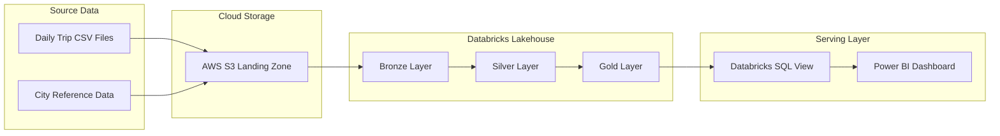
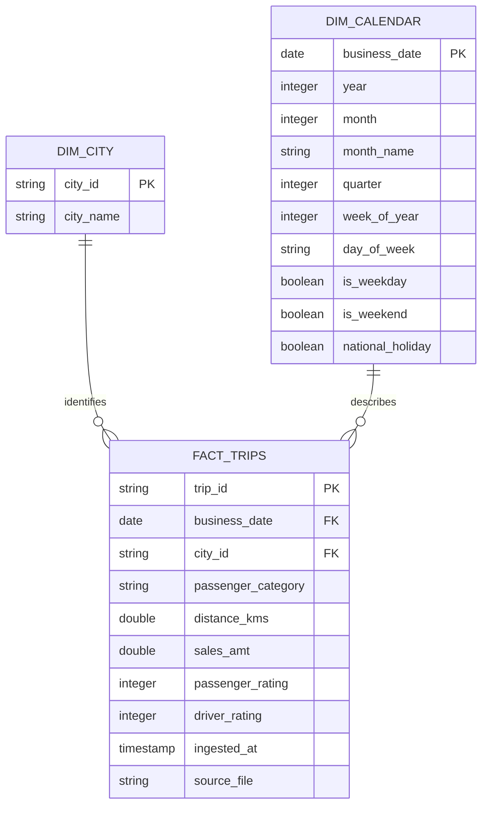

# OLA Ride Performance Analytics Pipeline


An end-to-end ride analytics project built with **Databricks, PySpark, Delta Lake, AWS S3, SQL, and Power BI**.

The project processes ride-level data through a lakehouse pipeline, validates and standardizes incoming records, enriches trips with city and calendar dimensions, and publishes an analytics-ready Gold table.

It supports both full refreshes and incremental Delta Lake upserts. The final dataset powers an executive dashboard covering approximately **366K trips**, **₹94M in sales**, **3M kilometres travelled**, customer behavior, city performance, and service-quality metrics.

---

## Executive Dashboard

<p align="center">
  
</p>

<p align="center">
  <strong>AWS S3 → Bronze → Silver → Gold → Power BI</strong>
</p>

The dashboard combines financial, operational, customer, and service-quality metrics into one reporting view.

### Key results

| KPI | Dashboard Result |
|---|---:|
| Total sales | Approximately ₹94M |
| Total trips | Approximately 366K |
| Total distance | Approximately 3.0M KM |
| Average driver rating | 7.85 |
| Average passenger rating | 7.92 |
| Cities analyzed | 10 |
| Analysis period | August–December 2025 |

### Dashboard filters

- Business date
- City
- Passenger category
- Weekday or weekend

### Dashboard visuals

- Sales by city
- Monthly sales trend
- Driver rating by city
- Passenger composition
- Weekday versus weekend demand
- Trips by day
- City performance summary

---

## Business Problem

Ride platforms generate large volumes of trip-level records across different cities and dates.

Raw trip files alone cannot reliably support reporting because they may contain:

- Duplicate trip IDs
- Missing business keys
- Invalid ratings
- Negative fares or distances
- Inconsistent passenger categories
- Updates to previously received trips
- Records that do not match a valid city

This project creates a controlled pipeline that converts these raw files into a validated analytical model.

The final dataset helps answer questions such as:

- Which cities generate the highest sales?
- How does revenue change month by month?
- Which cities have the strongest trip demand?
- What percentage of trips comes from repeated passengers?
- How does demand differ between weekdays and weekends?
- Which days of the week generate the most trips?
- Which cities have the best driver and passenger ratings?
- Are high-revenue cities also delivering strong service quality?

---

## Solution Architecture



### End-to-end data flow

```text
Trip and City CSV Files
          │
          ▼
AWS S3 Landing Zone
          │
          ▼
Bronze Layer
Raw records, source filename and ingestion timestamp
          │
          ▼
Silver Layer
Validation, standardization and deduplication
          │
          ▼
Gold Layer
City and calendar enrichment
          │
          ▼
Databricks SQL View
Analytics-ready reporting interface
          │
          ▼
Power BI Dashboard
KPIs, trends, rankings and customer insights
```

---

## Technology Stack

| Layer | Technology | Responsibility |
|---|---|---|
| Cloud storage | AWS S3 | Stores full-load and incremental files |
| Lakehouse platform | Databricks | Runs the transformation workflow |
| Processing engine | Apache Spark | Performs distributed processing |
| Programming language | PySpark | Implements data transformations |
| Table format | Delta Lake | Stores reliable analytical tables |
| Governance | Unity Catalog | Organizes catalogs, schemas, and tables |
| Analytics | Databricks SQL | Exposes the reporting dataset |
| Visualization | Power BI | Displays KPIs and analytical insights |
| Data modeling | SQL | Creates the dashboard-facing view |
| Measures | DAX | Defines reusable Power BI calculations |
| Validation | Python | Checks repository structure and assets |

---

## Medallion Architecture

### Bronze Layer

The Bronze layer ingests source files with an explicit schema and operational metadata.

```python
def read_bronze_trips(
    spark: SparkSession,
    path: str
) -> DataFrame:
    return (
        spark.read
        .option("header", True)
        .schema(TRIP_SCHEMA)
        .csv(path)
        .withColumn(
            "source_file",
            F.input_file_name()
        )
        .withColumn(
            "ingested_at",
            F.current_timestamp()
        )
    )
```

Bronze responsibilities:

- Read CSV files from the supplied storage path
- Apply a defined Spark schema
- Preserve source records
- Capture the source filename
- Add an ingestion timestamp
- Provide traceability for downstream processing

---

### Silver Layer

The Silver layer standardizes and validates the Bronze records.

```python
valid = (
    bronze
    .withColumn(
        "passenger_category",
        F.lower(F.trim("passenger_type"))
    )
    .withColumnRenamed(
        "date",
        "business_date"
    )
    .withColumnRenamed(
        "distance_travelled_km",
        "distance_kms"
    )
    .withColumnRenamed(
        "fare_amount",
        "sales_amt"
    )
    .filter(F.col("trip_id").isNotNull())
    .filter(F.col("business_date").isNotNull())
    .filter(F.col("city_id").isNotNull())
    .filter(F.col("distance_kms") >= 0)
    .filter(F.col("sales_amt") >= 0)
    .filter(
        F.col("passenger_rating").between(1, 10)
    )
    .filter(
        F.col("driver_rating").between(1, 10)
    )
)
```

Silver transformations include:

- Standardizing passenger categories
- Renaming business columns
- Validating mandatory identifiers
- Rejecting negative distance values
- Rejecting negative sales amounts
- Validating driver ratings
- Validating passenger ratings
- Deduplicating records by trip ID

### Deduplication strategy

When multiple records have the same trip ID, the pipeline keeps the latest ingested version.

```python
newest_record = (
    Window
    .partitionBy("trip_id")
    .orderBy(
        F.col("ingested_at").desc()
    )
)

silver = (
    valid
    .withColumn(
        "row_number",
        F.row_number().over(newest_record)
    )
    .filter("row_number = 1")
    .drop("row_number")
)
```

---

### Gold Layer

The Gold layer combines validated trips with city and calendar information.

```python
gold = (
    trips
    .join(
        F.broadcast(cities),
        "city_id",
        "inner"
    )
    .join(
        calendar,
        "business_date",
        "inner"
    )
    .select(
        "trip_id",
        "business_date",
        "city_id",
        "city_name",
        "passenger_category",
        "distance_kms",
        "sales_amt",
        "passenger_rating",
        "driver_rating",
        "year",
        "month",
        "month_name",
        "quarter",
        "week_of_year",
        "day_of_week",
        "is_weekday",
        "is_weekend",
        "national_holiday",
        "ingested_at",
        "source_file",
    )
)
```

The resulting dataset is published as:

```text
transportation.gold.fact_trips
```

---

## Full and Incremental Loads

The pipeline supports two execution modes.

### Full load

The full-load path creates or replaces the Gold Delta table.

```python
gold.write \
    .format("delta") \
    .mode("overwrite") \
    .partitionBy("year", "month") \
    .saveAsTable(table_name)
```

The Gold table is partitioned by year and month to support common time-range queries.

### Incremental load

Incremental files are upserted with Delta Lake `MERGE`.

```python
target.alias("target") \
    .merge(
        gold.alias("source"),
        "target.trip_id = source.trip_id"
    ) \
    .whenMatchedUpdateAll() \
    .whenNotMatchedInsertAll() \
    .execute()
```

The incremental strategy provides:

- Inserts for newly received trips
- Updates for corrected trip records
- Protection against duplicate trip IDs
- Repeatable incremental processing
- A single current version of each trip

---

## Data Quality Rules

| Rule | Invalid record handling |
|---|---|
| Trip ID must exist | Record removed |
| Business date must exist | Record removed |
| City ID must exist | Record removed |
| Distance must be zero or greater | Record removed |
| Sales amount must be zero or greater | Record removed |
| Driver rating must be between 1 and 10 | Record removed |
| Passenger rating must be between 1 and 10 | Record removed |
| Trip ID must be unique | Latest ingested record retained |
| City ID must exist in city data | Unmatched record excluded from Gold |

---

## Calendar Enrichment

The pipeline dynamically builds a calendar dimension using the minimum and maximum trip dates.

Generated calendar attributes include:

| Attribute | Analytical use |
|---|---|
| `year` | Annual reporting |
| `month` | Numerical month sorting |
| `month_name` | Dashboard labels |
| `quarter` | Quarterly analysis |
| `week_of_year` | Weekly trend analysis |
| `day_of_week` | Day-level demand |
| `is_weekday` | Weekday segmentation |
| `is_weekend` | Weekend segmentation |
| `national_holiday` | Holiday analysis |

The implementation identifies:

- Republic Day
- Independence Day
- Gandhi Jayanti

---

## Analytical Data Model



---

## Reporting View

The Gold fact table is exposed through a dedicated analytics view.

```sql
CREATE OR REPLACE VIEW
    transportation.gold.vw_ride_performance
AS
SELECT
    business_date,
    city_id,
    city_name,
    passenger_category,
    distance_kms,
    sales_amt,
    passenger_rating,
    driver_rating,
    year,
    month,
    month_name,
    quarter,
    week_of_year,
    day_of_week,
    is_weekday,
    is_weekend,
    national_holiday
FROM transportation.gold.fact_trips;
```

Source:

[`sql/dashboard_dataset.sql`](sql/dashboard_dataset.sql)

Using a reporting view provides Power BI with a stable interface without exposing intermediate pipeline tables.

---

## Power BI Measures

The dashboard uses reusable DAX measures stored in:

[`powerbi/measures.dax`](powerbi/measures.dax)

```DAX
Total Sales =
SUM(fact_trips[sales_amt])

Total Trips =
COUNTROWS(fact_trips)

Total Distance =
SUM(fact_trips[distance_kms])

Average Driver Rating =
AVERAGE(fact_trips[driver_rating])

Average Passenger Rating =
AVERAGE(fact_trips[passenger_rating])
```

---

## Dashboard Insights

### City performance

The dashboard compares sales, trip volume, travelled distance, and service ratings across ten cities.

Jaipur appears as the highest-sales city in the displayed reporting period, followed by Lucknow and Hyderabad.

### Monthly performance

The monthly trend visual shows sales growth across the August–December analysis period.

### Passenger composition

Trips are segmented into:

- New passengers
- Repeated passengers

This supports repeat-usage and passenger-retention analysis.

### Weekday and weekend demand

The dashboard separates weekday and weekend journeys to show differences in travel behavior.

### Service quality

Driver and passenger ratings are compared by city, helping identify markets with strong commercial performance but weaker customer experience.

---

## Repository Structure

```text
ola-ride-performance-analytics/
│
├── src/
│   └── ola_pipeline.py
│
├── sql/
│   └── dashboard_dataset.sql
│
├── powerbi/
│   └── measures.dax
│
├── sample_data/
│   ├── trips.csv
│   └── cities.csv
│
├── scripts/
│   └── validate_project.py
│
├── docs/
│   └── Codex Image Sep 11, 2026, 12_59_49 AM.png
│
├── requirements.txt
├── .gitignore
└── README.md
```

---

## Input Data

### Trip schema

```text
trip_id
date
city_id
passenger_type
distance_travelled_km
fare_amount
passenger_rating
driver_rating
```

Example:

```csv
trip_id,date,city_id,passenger_type,distance_travelled_km,fare_amount,passenger_rating,driver_rating
TRIP001,2026-01-01,RJ01,new,12,180,8,9
TRIP002,2026-01-01,UP01,repeated,7,105,9,8
TRIP003,2026-01-02,GJ01,new,18,270,7,9
```

### City schema

```text
city_id
city_name
```

Example:

```csv
city_id,city_name
RJ01,Jaipur
UP01,Lucknow
GJ01,Surat
```

The repository contains a small synthetic dataset for reviewing the expected schema. The complete training dataset is excluded because redistribution rights were not supplied.

---

## How to Run

### Prerequisites

- Python 3.10 or newer
- Apache Spark
- Delta Lake
- Databricks workspace
- Unity Catalog permissions
- Storage accessible from Databricks
- Power BI Desktop for dashboard recreation

### 1. Clone the repository

```bash
git clone https://github.com/syedsaud15/ola-ride-performance-analytics.git
cd ola-ride-performance-analytics
```

### 2. Create a virtual environment

```bash
python -m venv .venv
```

Activate it:

```bash
# Windows
.venv\Scripts\activate

# macOS or Linux
source .venv/bin/activate
```

### 3. Install dependencies

```bash
pip install -r requirements.txt
```

### 4. Run a full load

```bash
spark-submit src/ola_pipeline.py \
  --trips-path /path/to/trips \
  --cities-path /path/to/cities.csv \
  --catalog transportation \
  --mode full
```

Example using AWS S3:

```bash
spark-submit src/ola_pipeline.py \
  --trips-path s3://your-bucket/ola/trips/full-load/ \
  --cities-path s3://your-bucket/ola/reference/cities.csv \
  --catalog transportation \
  --mode full
```

### 5. Run an incremental load

```bash
spark-submit src/ola_pipeline.py \
  --trips-path s3://your-bucket/ola/trips/incremental/ \
  --cities-path s3://your-bucket/ola/reference/cities.csv \
  --catalog transportation \
  --mode incremental
```

### 6. Create the reporting view

Run:

```text
sql/dashboard_dataset.sql
```

The resulting view is:

```text
transportation.gold.vw_ride_performance
```

### 7. Connect Power BI

Connect Power BI to the Databricks SQL warehouse and select:

```text
transportation.gold.vw_ride_performance
```

Create the measures from:

```text
powerbi/measures.dax
```

---

## Local Validation

Run the credential-free checks:

```bash
python -m py_compile src/ola_pipeline.py
python scripts/validate_project.py
```

The validation script checks that:

- Required pipeline files exist
- Python syntax is valid
- Sample CSV files contain records
- SQL and Power BI assets are present
- Dashboard evidence exists

These checks do not replace a live Databricks integration run.

---

## Engineering Decisions

### Explicit Spark schemas

Explicit schemas prevent inconsistent type inference across daily CSV files.

### Latest-record deduplication

Window-based deduplication ensures that corrected trip records replace older versions.

### Broadcast city join

City data is a small reference dataset, making it suitable for a broadcast join and reducing shuffle overhead.

### Year and month partitioning

The Gold table is partitioned by year and month because time-based filtering is common in analytical workloads.

### Delta Lake upserts

Delta `MERGE` handles new records and corrections without requiring a full table rebuild.

### Separate reporting view

Power BI reads from a stable SQL view, keeping dashboard logic independent of the underlying physical table.

### Operational metadata

Source filename and ingestion timestamp make records easier to trace during investigation.

---

## Repository Security

- No AWS credentials are committed.
- No Databricks access tokens are committed.
- No Power BI credentials are committed.
- Local environment files are excluded.
- Python cache files are excluded.
- The complete source dataset is not redistributed.
- Tracked sample records are synthetic.

---

## Current Limitations

This is a portfolio implementation that requires external platforms for complete execution.

The repository currently does not include:

- Infrastructure as Code
- Automated Databricks deployment
- A deployable Power BI report file
- Automated pipeline monitoring
- Quarantine tables for rejected records
- Production-scale performance benchmarks
- Integration tests against a live workspace

These limitations are documented so the public claims remain supported by repository code and dashboard evidence.

---

## Future Improvements

- Add a rejected-record quarantine layer
- Add pipeline audit and row-count metrics
- Add Databricks job configuration
- Add late-arriving data handling
- Add automated data-quality summaries
- Add a Docker-based local Spark environment
- Add live integration tests
- Add Power BI refresh monitoring
- Add automated deployment of Databricks assets

---

## Author

**Syed Saud Alam**

Data Engineer focused on Python, SQL, PySpark, Databricks, Snowflake, dbt, Apache Airflow, Power BI, and cloud data platforms.

- [GitHub](https://github.com/syedsaud15)
- [Portfolio](https://syedsaud15.github.io/syed-saud-portfolio/)
